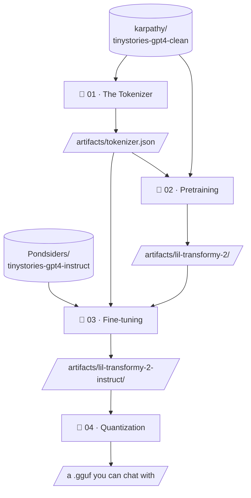

# Lil Transformy 2

> Once upon a time, there was a rhinoceros named Remy. Remy lived in a big forest with his friends. They played together every day.
>
> One day, Remy saw a big rock. He wanted to split it. He pushed and pushed, but the rock did not move. Remy felt sad. His friend, a little bird, saw Remy and asked, "Why are you sad, Remy?"
>
> Remy said, "I want to split this big rock, but I can't. I want to split it." The bird wanted to help Remy. They pushed the rock together. It was still difficult to split. But they did it! Remy and the bird split the rock and were very happy. They played with the big rock all day.

— *Lil Transformy 2* (7,868,672 parameters, temperature 0.7)

## What this is

Four notebooks that build a small language model from scratch: tokenizer, pretraining, fine-tuning, quantization. The model is written out in plain PyTorch exactly once, in the notebook that trains it; everything downstream loads artifacts from disk with ordinary library code. The notebooks never import each other. The filesystem is the framework.

- [x] [01 · The Tokenizer](01-tokenizer.ipynb) — a 4,096-token byte-level BPE, trained on the corpus
- [x] [02 · Pretraining](02-pretraining.ipynb) — the model, organ by organ, trained on 554M tokens
- [ ] 03 · Fine-tuning — teaching it to answer "Tell me a story about a girl named Lily"
- [ ] 04 · Quantization — down to a GGUF that runs in llama.cpp

## The model

| | |
| --- | --- |
| Architecture | Llama, shrunk: RMSNorm · RoPE · SwiGLU · tied embeddings |
| Parameters | 7,868,672 |
| Shape | d_model 256 · 8 layers · 8 heads · d_ff 768 · context 512 |
| Corpus | 554M tokens of TinyStories, GPT-4 stories only |
| Training | 16,500 steps · batch 64 × 512 · one pass over the corpus |
| Validation loss | 1.3005 (perplexity ≈ 3.7) |
| Sampling | temperature 0.7 · top-p 0.95 |

> [!NOTE]
> The full pretraining run takes 8 minutes 53 seconds on a rented RTX 4090 — about a quarter's worth of GPU time.

## Running it

Each notebook runs top to bottom in plain Jupyter. Notebook 1 runs anywhere; notebook 2 wants a CUDA GPU (a rented one is fine — that's what we use). `requirements.txt` lists the handful of packages a stock PyTorch 2.8 pod image doesn't already have. Artifacts land in `artifacts/`, which is gitignored: the repo is the recipe, not the pantry.

📖 One more story

> Once upon a time, there was a little girl named Lucy. She lived in a small house with her mom, dad, and her dog, Max. Lucy liked to play with her toys and run in the park. One day, Lucy saw a big, red ball in the park. She wanted to play with it, but she did not know who it belonged to.
>
> Lucy asked her mom and dad, "Can I play with the big, red ball?" Her mom and dad said, "Yes, but you must be patient and wait. We love you and want you to be happy." Lucy nodded and went to play with her ball.
>
> While playing, Lucy kicked the ball very hard. The ball went far away and landed in a tree. Lucy was sad, but she did not give up. She found a long stick and tried to get the ball out of the tree. After a while, she got the ball out and gave it back to her mom and dad. They were so proud of her for being patient and kind. Lucy learned that sometimes, it's good to ask for help and be patient.

— *the same author, from a bare prompt*

